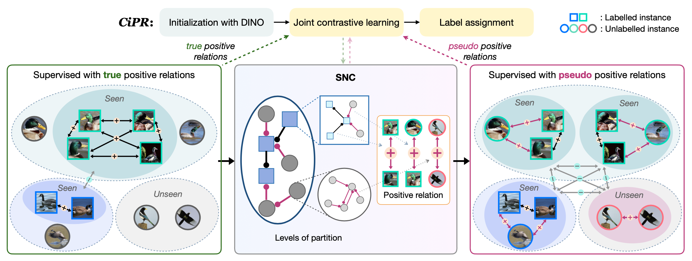

# CiPR
[](https://arxiv.org/abs/2304.06928)


This is the official PyTorch codes for the paper:  

[**CiPR: An Efficient Framework with Cross-instance Positive Relations for Generalized Category Discovery**](https://arxiv.org/abs/2304.06928)  
[Shaozhe Hao](https://haoosz.github.io/),
[Kai Han](https://www.kaihan.org/), 
[Kwan-Yee K. Wong](http://i.cs.hku.hk/~kykwong/)  
TMLR  

### [Code](https://github.com/haoosz/CiPR) | [Paper](https://arxiv.org/abs/2304.06928)




*TL;DR: A simple cross-attention mechanism is efficient to disentangle visual concepts, i.e., attribute and object concepts, enhancing CZSL performance.*

---

## Setup

Create a conda environment `cipr` using
```
conda create -n cipr python=3.8.12
conda activate cipr
conda install pytorch==1.7.1 torchvision==0.8.2 cudatoolkit=11.0
pip install -r requirements.txt
```

## Dataset

We use finegrained datasets, including:

* [The Semantic Shift Benchmark (SSB)](https://github.com/sgvaze/osr_closed_set_all_you_need#ssb) and [Herbarium19](https://www.kaggle.com/c/herbarium-2019-fgvc6)

We also use generic image recognition datasets, including:

* [CIFAR-10/100](https://pytorch.org/vision/stable/datasets.html) and [ImageNet](https://image-net.org/download.php)

## Run the codes

We train the model using
```
python run.py --dataset_name DATASET
```

and we test the model using
```
python run.py --dataset_name DATASET --mode test
```

## Test with different clustering methods

We first obtain the extracted features using
```
bash scripts/get_feat.sh
```

With the obtained features, we test the model with our *selective neighbor clustering* (SNC) using
```
python eval_snc.py
```
The implementation of SNC can be found in `./snc/clustering.py`. It is an efficient semi-supervised clustering method ready for deployment off the shelf.

Alternatively, we test with semi-supervised k-means using
```
python sskmeans.py
```

## Citation
If you use this code in your research, please consider citing our paper:
```bibtex
@article{hao2024cipr,
    title={Ci{PR}: An Efficient Framework with Cross-instance Positive Relations for Generalized Category Discovery},
    author={Shaozhe Hao and Kai Han and Kwan-Yee K. Wong},
    journal={Transactions on Machine Learning Research},
    issn={2835-8856},
    year={2024},
    url={https://openreview.net/forum?id=1fNcpcdr1o}}
```

## Acknowledgements
This project is based on [GCD](https://github.com/sgvaze/generalized-category-discovery). Thanks for the great work!